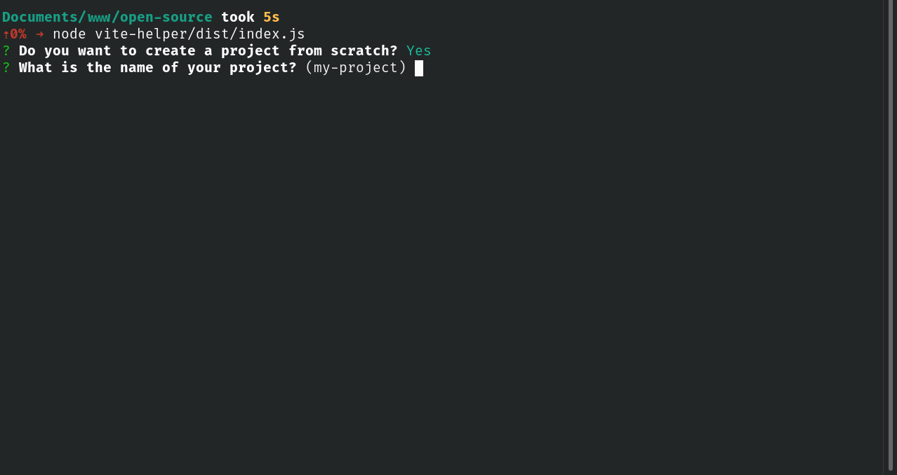

<h1 align="center" title="Vite Helper">
  Vite Helper
</h1>

<h2 align="center">Vite helper helps you configure tools for react projects with vite</h2>

<h4 align="center">
 <a href="#-how-use-">✨ How use</a> •
 <a href="#️-tools">🛠️ Tools</a>
</h4>

<br>



# ✨ How use ?

Run:

```bash
npx vite-helper
```

Answer the questions (When choosing the tool, use the arrows keys to navigate, the spacebar to select and enter to finish)

# 🛠️ Tools

## 🧑‍💻 To Improve Developer experience

- ESlint, Prettier and Editorconfig
- Vite svgr
- Lint Staged (with husky) | Under development
- Commitizen and Commitlint (with husky) | Under development
- Basic CI (with github actions) | Under development

## 🎨 Style Libraries

- Tailwind | Under development
- Styled Components | Under development

## ✨ Others

- Storybook | Under development

## 🧪 Tests

- Jest | Under development
